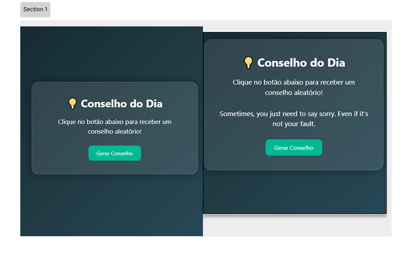

<h1 align="center">
🚀✅ 🧠 Gerador de Conselhos  - Concluído ✅🚀
</h1>

## 📄 Descrição do entregável

- `index.html`: arquivo principal do projeto
- `src`: pasta que contém os arquivos fonte do projeto  
  - `styles`: folhas de estilo CSS  
  - `js`: arquivos JavaScript
 
   <!-- MODELO DESCRIÇÃO SOBRE O PROJETO: -->
## 💻 Sobre o projeto

<!-- EXPLICA O MOTIVO DO PROJETO -->
Este projeto foi feito como exercício passado pelo professor. Ele mostra conselhos diferentes toda vez que o usuário clicar no botão. Os conselhos vêm de uma API Pública e trazem dicas para o dia a dia.
<!-- LINHA DE DIVISÃO: -->

---
## 🎨 Layout

<!-- AQUI VOCÊ PASSA O CAMINHO DA IMAGEM -->


---
<!-- MODELO DE COMO EXECUTAR O PROJETO -->
## 🚀 Como executar o projeto

1. Clone o repositório:
   ```bash
   https://github.com/Joao-vitorSantos08/gerador-de-conselhos.git
2. Acesse a pasta do projeto:
   
   ```bash
   cd gerador-de-conselhos


<!------------------------------------------------------------------------ -->

 ### ✅ Pré-requisitos
  
 - Navegador web moderno (Chrome, Firefox, Edge, Safari) para abrir e testar o projeto  
 - Editor de código recomendado: Visual Studio Code

## 🛠 Tecnologias

- **HTML**: Estruturação do conteúdo e elementos da página.  
- **CSS**: Estilização e layout responsivo.  
- **JavaScript**: Código responsável por buscar conselhos na API quando o usuário clica no botão..  
- **Git**: Sistema de controle de versão para gerenciamento de alterações no código.  
- **GitHub**: Plataforma de hospedagem para o repositório do projeto.

<!-- MODELO DE COMO CONTRIBUIR PARA O PROJETO -->
## 💪 Como contribuir para o projeto

1. Faça um **fork** do projeto.
2. Crie uma nova branch com as suas alterações: `git checkout -b my-feature`
3. Salve as alterações e crie uma mensagem de commit contando o que você fez: `git commit -m "feature: My new feature"`
4. Envie as suas alterações: `git push origin my-feature`
> Caso tenha alguma dúvida confira este [guia de como contribuir no GitHub](./CONTRIBUTING.md)

---

<!-- ---------------------------------------------------------------------- -->

<!-- MODELO DE AUTOR-->
## 👨🏽‍💻 Autor

<a href="https://br.linkedin.com/in/Joao-vitorSantos08">
João Vitor Santos souza</a>
 <br />
 
<!--[](mailto:mthalvarez2005@gmail.com) -->

---

<!-- ---------------------------------------------------------------------- -->

<!-- MODELO DE LICENÇA -->
## 📝 Licença

Este projeto esta sobe a licença [MIT](./LICENSE).

Feito por João Vitor Santos Souza👋🏽


